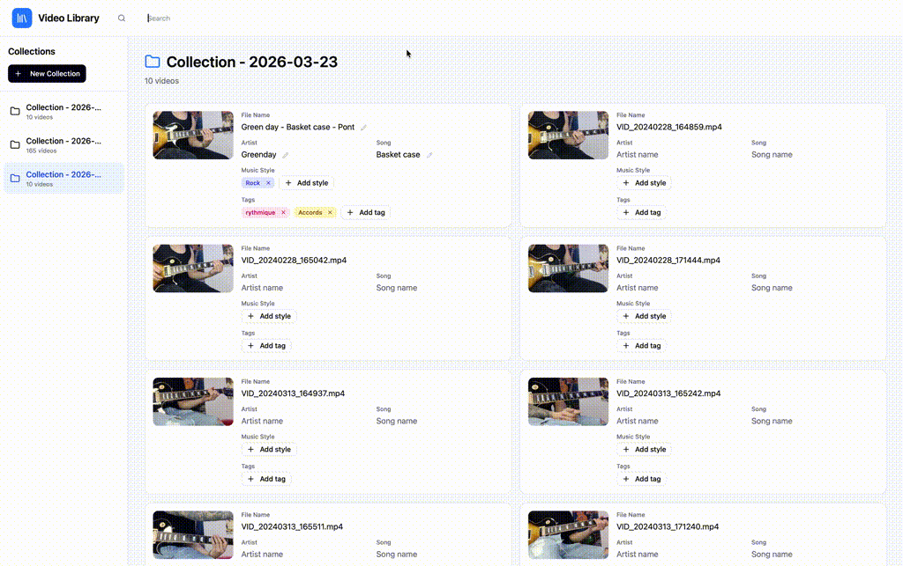

# Alexandria

I needed a simple app to search for videos my guitar teacher, John, records every week when he teaches me new songs, technics...
So I built this app.

The purpose of this app is to build video collections and search for videos.

The search engine is built up upon natural language processing (kind of) and uses the following information registered on videos:

- Video title
- Artist
- Song
- Style
- Tags

Below you have gifs showing the app in action.

- [How to create a collection](#create-a-collection-)
- [How to search for videos](#video-search)

## Development

### Install `pre-commit` `hook`

```shell
$ chmod +x .githooks/pre-commit
$ git config core.hooksPath .githooks
```

### Run tests

#### Run all tests

```shell
pnpm run test
```

#### Run front tests

```shell
pnpm run test:front
```

#### Run Tauri tests

```shell
pnpm run test:back
```

### Run application during dev

```shell
pnpm run dev
```

### Build app

```shell
pnpm run build
```

## Usage

## Create a collection


## Video search


